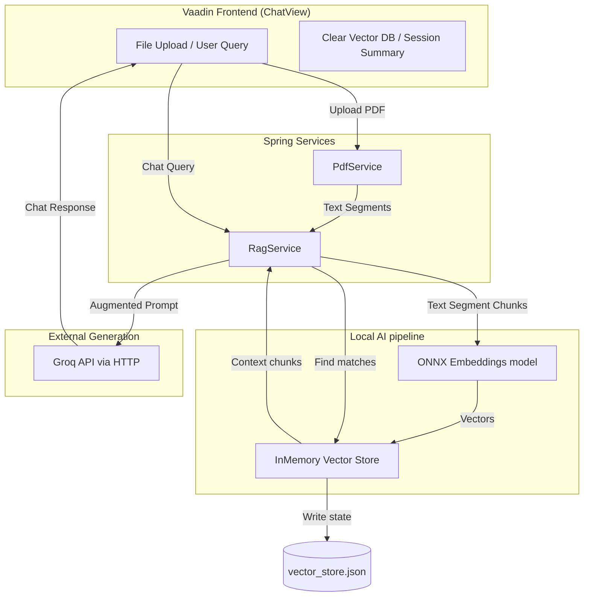

# RAG Assist: 100% Java-Based PDF Chatbot

RAG Assist is a professional, high-performance Retrieval-Augmented Generation (RAG) web application built entirely on a modern Java stack. It allows users to upload PDF documents, index their content into a local vector database, and chat with an LLM (using Groq API) regarding the documents' content.

---

## 🌟 Key Features

*   **100% Java Stack**: No Python runtime dependencies. All text extraction, chunking, embedding generation, and LLM orchestration happen directly inside the Java Virtual Machine.
*   **Local Embedding Processing**: Generates embeddings using a JVM-native `all-MiniLM-L6-v2` ONNX model. Computation is completely offline and ultra-fast.
*   **Zero-Dependency Vector Store**: Persists vector representations locally on disk using LangChain4j's `InMemoryEmbeddingStore` (`vector_store.json`), avoiding complex external database configurations.
*   **Interactive PDF Summarizer**: Generates concise, bulleted summaries of uploaded documents with a single click.
*   **Claude Warm Letterpress Aesthetic**: A bespoke custom theme incorporating a warm ivory palette, hairline linen borders, and humanist Inter and Source Serif typography.
*   **Zero-Config Security**: A sidebar-accessible API key configuration panel lets users run their queries securely via the Groq LLM API.

---

## 🛠️ Tech Stack

*   **Core Framework**: Spring Boot 3.5.0
*   **Frontend UI**: Vaadin Flow 24.x (Reactive web components)
*   **RAG Engine**: LangChain4j 0.35.0
*   **Local Embeddings**: ONNX runtime via quantized MiniLM-L6-v2
*   **PDF Parser**: Apache PDFBox 3.0.2
*   **Deployment Hosting**: Docker, Hugging Face Spaces

---

## 🏗️ Architecture Overview

The system processes incoming files and queries using the following pipeline:



---

## 🚀 Installation & Local Run

### Prerequisites

*   **Java Development Kit (JDK) 21** or higher.
*   **Maven 3.9+** (or use the packaged `./mvnw` wrapper).

### Steps

1.  **Clone the Repository**:
    ```bash
    git clone https://github.com/revanthh04/RAG.git
    cd RAG
    ```

2.  **Configure Environment Variables**:
    Create a `.env` file in the root folder of the project:
    ```env
    GROQ_API_KEY=your_groq_api_key_here
    ```

3.  **Run the Application**:
    ```bash
    ./mvnw spring-boot:run
    ```
    The application will automatically initialize and start listening on [http://localhost:8080](http://localhost:8080).

4.  **Production Production Compilation (Vaadin Bundle)**:
    To build the production JAR with optimized Vaadin web components compiled:
    ```bash
    ./mvnw clean package -Pproduction
    java -jar target/rag-0.0.1-SNAPSHOT.jar
    ```

---

## 🐳 Docker Deployment

The application features a multi-stage Docker build config that automatically compiles frontend assets and serves the package in production mode.

### Build and Run Docker Container Locally

1.  **Build image**:
    ```bash
    docker build -t rag-assist .
    ```

2.  **Run container**:
    ```bash
    docker run -p 8080:7860 -e GROQ_API_KEY="your-api-key" rag-assist
    ```
    Open [http://localhost:8080](http://localhost:8080) to access the app.

---

## 📂 Project Structure

For a comprehensive explanation of file mappings, view the **[PROJECT_STRUCTURE.md](file:///Users/revanthh/Desktop/RAG/PROJECT_STRUCTURE.md)** document.

---

## 🤝 Contributing & License

Contributions are highly welcome. Please consult the **[CONTRIBUTING.md](file:///Users/revanthh/Desktop/RAG/CONTRIBUTING.md)** document for details on styling guidelines, pull request protocols, and the active **[CODE_OF_CONDUCT.md](file:///Users/revanthh/Desktop/RAG/CODE_OF_CONDUCT.md)**.

Distributed under the MIT License. See `LICENSE` for more details.

---

## 👤 Author Information

*   **Revanth** - *Initial Creator & Maintainer*
*   GitHub: [@revanthh04](https://github.com/revanthh04)
